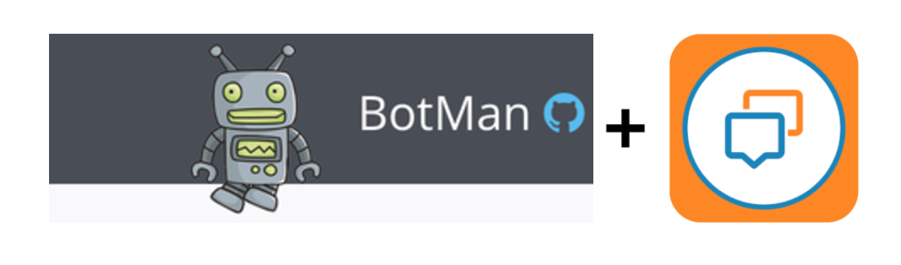

# Botman - Glip

[Botman](https://botman.io/1.5/installation) adapter to use with [Glip](https://glip.com/).



## Creating a new bot

- `git clone https://github.com/anilkumarbp/Botman-Glip.git`
- `cd Botman-Glip`
- `composer install`


## Testing your bot

### Provide Glip User details in `index.php` file:
```php
/*
 *  For Glip configuration
 */

$config = [
    'GLIP_SERVER' =>    'https://platform.devtest.ringcentral.com',    // Server Url ( Production: https://platform.ringcentral.com || Sandbox: https://platform.devtest.ringcentral.com )
    'GLIP_APPKEY' =>    'appKey',                                      // appKey
    'GLIP_APPSECRET' => 'appSecret',                                // appSecret
    'GLIP_USERNAME' =>  'Username',                                  // username
    'GLIP_PASSWORD' =>  'Password',                                  // password
    'GLIP_EXTENSION' => 'Extension'                                 // extension
];


// create an instance
$botman = BotManFactory::create($config);

// To Create the Subscription using Webhooks
$cacheDir = __DIR__ . DIRECTORY_SEPARATOR . '_subscribe';
if (!file_exists($cacheDir)) {
    mkdir($cacheDir);
    return $botman->verifyServices();
}


// give the bot something to listen for.
$botman->hears('hello', function (BotMan $bot) {
    $bot->reply('Hello yourself.');
});

// give the bot something to listen for.
$botman->hears('how are you doing', function (BotMan $bot) {
    $bot->reply('I am fine how are you doing today ?');
});

$botman->hears('what is my name', function (BotMan $bot) {
    $bot->reply('My name is Adam');
});

// start listening
$botman->listen();
```

### Start PHP Built-In Server 
```php
php -S localhost:8080
```

### Start ngrok (for demo purposes using ngrok)

```bash
$ ngrok http 8080
```

### Create Subscription Using Webhooks
Just point the webhook subscription URL to: ( you must start ngrok if using it )
```php
https://f0aad057.ngrok.io/index.php
```

You are all set, to start seeing the Bot live in action, type the command `hello` in the glip group:

## Extending the Botman-Glip Adapter

You can set the `Bot` to listen to any specific commands/instructions
```php
/ give the bot something to listen for.
$botman->hears('hello', function (BotMan $bot) {
    $bot->reply('Hello yourself.');
});

// give the bot something to listen for.
$botman->hears('how are you doing', function (BotMan $bot) {
    $bot->reply('I am fine how are you doing today ?');
});
```

For more details, please take a look at Botman's official guide on [Hearing Messages](https://botman.io/1.5/receiving)

## Configuration

This adapter uses the following configuration variables as per `index.php`:

- `GLIP_SERVER` - RingCentral Server.
- `GLIP_APPKEY` - RingCentral App Key.
- `GLIP_APPSECRET` - RingCentral App Secret
- `GLIP_USERNAME` - RingCentral Username ( The username of the user on `Glip` )  
- `GLIP_PASSWORD` - RingCentral password ( The password for the user on `Glip` )
- `GLIP_EXTENSION` - RingCentral extension ( The ext of the user on `Glip` )

## Dependencies

Currently used RingCentral-PHP SDK version for this demo:  
[ "ringcentral/ringcentral-php": "^2.0.0"](https://github.com/ringcentral/ringcentral-php)  
["mpociot/botman":"latest"](https://github.com/mpociot/botman)

* Make sure to change the SDK version in the composer.json before you chose to use a different SDK Version.


## Links

Project Repo

* https://github.com/anilkumarbp/Botman-Glip

RingCentral SDK for PHP

* https://github.com/ringcentral/ringcentral-php

RingCentral API Docs

* https://developer.ringcentral.com/api-and-docs.html

RingCentral API Explorer

* https://developer.ringcentral.com/api-explorer/latest/index.html

## Contributions

Any reports of problems, comments or suggestions are most welcome.

Please report these on [Botman-Glip's Issue Tracker in Github](https://github.com/anilkumarbp/Botman-Glip/issues).

## License

RingCentral SDK is available under an MIT-style license. See [LICENSE.txt](LICENSE.txt) for details.

RingCentral SDK &copy; 2017 by RingCentral

## FAQ

* What if I do not have a RingCentral account? Don't have an account, no worries: [Become a RingCentral Customer](https://www.ringcentral.com/office/plansandpricing.html)
* I/My company is an Independent Software Vendor (ISV) who would like to integrate with RingCentral, how do I do that? You can apply to [Join the RingCentral Partner Program](http://www.ringcentral.com/partner/isvreseller.html)